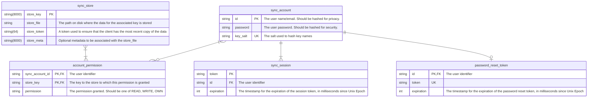

# Sync Node

Sync Node is a general-purpose backend sync server. It is designed to augment
[local-first] software by simply providing an endpoint with which to sync data
across devices and/or between users. Note that Sync Node does not concern itself
with end-to-end encryption; this is by design. Nothing is stopping you from
encrypting the data before submitting it to Sync Node, and in fact it's
encouraged to do so. Key management and encryption are exercises left to the
clients, however. If your use case requires a more "batteries included" approach
to end-to-end encryption, consider using something like [etebase] instead.

## Configuration

Configuration is handled exclusively through the following environment variables:

|  Environment Variable  |  Default Value  |
|:----------------------:|:---------------:|
|         `PORT`         |     `8080`      |
|     `STATIC_ROOT`      |    `./data`     |

## Goals

1. Provide a general-purpose backend that requires little-to-no configuration to
   enable syncing for [local-first] applications.
2. Minimize resource usage on the server
3. Maximize longevity of the project
4. Simplify installation/updates

## Data Model

[etebase]: https://www.etebase.com/

[local-first]: https://www.inkandswitch.com/local-first/
